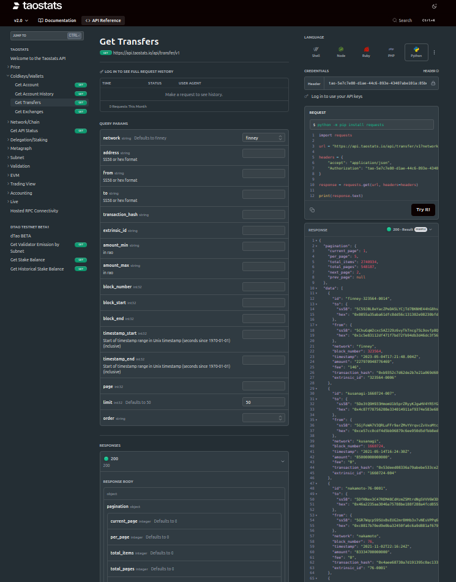
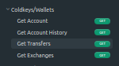
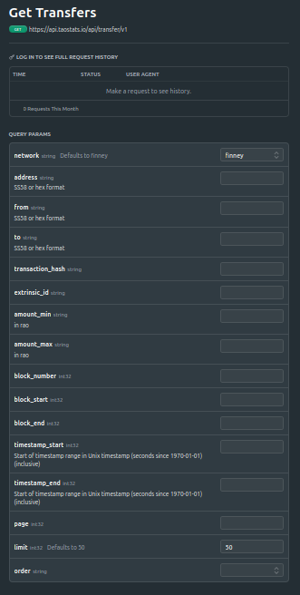
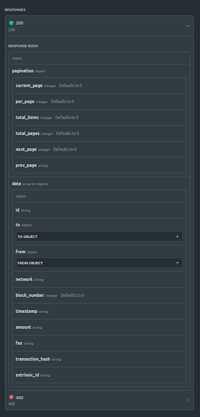

# Contributing to Taostats API Documentation

This guide explains how to document the Taostats API using Cursor IDE and Claude 3.5 Sonnet. For the complete API documentation, see the [main README](README.md).

For reference, you can find the official Taostats API documentation at [docs.taostats.io](https://docs.taostats.io/reference/welcome-to-the-taostats-api).

## Documentation Process

### 1. Capture API Documentation
First, capture the API documentation from the Taostats website. This includes:
- Endpoint details
- Query parameters
- Response structure
- Example requests and responses

Here's an example of documenting the Get Transfers endpoint ([view original documentation](https://docs.taostats.io/reference/get-transfers)):

#### Overview and Endpoint


#### Query Parameters


#### Response Structure



### 2. Test the API Endpoint
Make a test request to get a real response from the API. Here's an example:

```python
import requests

url = "https://api.taostats.io/api/transfer/v1?network=finney&limit=50"
headers = {
    "accept": "application/json",
    "Authorization": "YOUR-API-KEY"
}

response = requests.get(url, headers=headers)
print(response.text)
```

### 3. Document Using Cursor + Claude

1. Open Cursor IDE and start a new conversation with Claude in the composer
2. Set Claude to agent mode
3. Share the following with Claude:
   - Screenshots of the API documentation (as shown above)
   - Your test request code
   - The API response

Claude will help create properly formatted markdown documentation following our standard structure:
- Endpoint description
- URL and method
- Query parameters table
- Response structure
- Example request and response
- Field descriptions
- Notes and additional information

### 4. Review and Commit

The documentation should be organized in the following structure:
```
docs/
├── category/           # e.g., coldkeys-wallets/
│   ├── index.md       # Category overview
│   └── endpoint.md    # Individual endpoint docs
```

## Tips for Good Documentation

1. **Consistency**: Follow the existing documentation format
2. **Completeness**: Include all parameters and response fields
3. **Examples**: Provide clear, working example requests
4. **Clarity**: Use tables for parameters and field descriptions
5. **Structure**: Maintain the established directory organization

## Documentation Progress

### Core Features
- [x] Project Setup
  - [x] README.md
  - [x] CONTRIBUTING.md
  - [x] Directory structure
  - [x] Documentation format established

- [ ] Price API
  - [ ] Get Price
  - [ ] Get Price History
  - [ ] Get Price OHLC

- [ ] Coldkeys/Wallets API
  - [ ] Get Account
  - [ ] Get Account History
  - [x] Get Transfers
  - [ ] Get Exchanges

- [ ] Network/Chain API
  - [ ] Get Blocks
  - [ ] Get Block Number over Interval
  - [ ] Get Extrinsics
  - [ ] Get Event
  - [ ] Get Chain Calls
  - [ ] Get Stats Latest
  - [ ] Get Stats History
  - [ ] Get Runtime Version
  - [ ] Get Historical Runtime Version
  - [ ] Get Proxy Calls

- [ ] API Status
  - [ ] Get API Status

- [ ] Delegation/Staking API
  - [ ] Get Stake (v2)
  - [ ] Get Slippage
  - [ ] Get Historical Stake
  - [ ] Get Staking/Delegation Events
  - [ ] Get dTao Delegation Events
  - [ ] Get Stake Balance Sum in Tao

### Beta Features
- [ ] dTAO TESTNET BETA
  - [ ] Overview
  - [ ] Endpoints

- [ ] dTao BETA
  - [ ] Overview
  - [ ] Endpoints

## Need Help?

If you need assistance with the documentation process, please:
1. Check the existing documentation for examples
2. Review the [main README](README.md) for structure guidelines
3. Open an issue for questions or clarification 